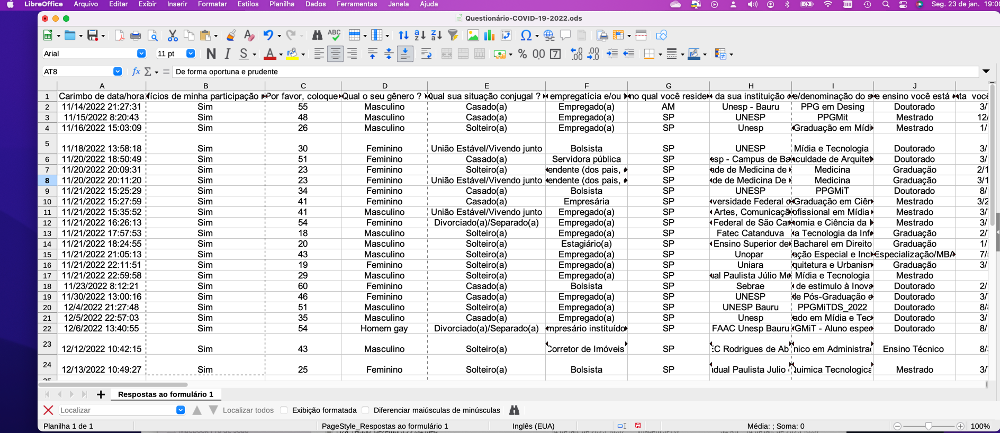

```{r, include=FALSE}
options(tinytex.verbose = TRUE)
```

```{r setup_inicial, include=FALSE}
# Função para obter em qual ambiente (Sistema Operacional) o RStudio está sendo executado
get_os <- function(){
  sysinf <- Sys.info()
  if (!is.null(sysinf)){
    os <- sysinf['sysname']
    if (os == 'Darwin')
      os <- "osx"
  } else { ## mystery machine
    os <- .Platform$OS.type
    if (grepl("^darwin", R.version$os))
      os <- "osx"
    if (grepl("linux-gnu", R.version$os))
      os <- "linux"
  }
  tolower(os)
}
if (get_os() == "windows"){
  knitr::opts_knit$set(root.dir = "D:/Github/espaco-virtual-e-geracoes")
  knitr::opts_knit$set(fig_path = ".png", list(fig.path = "D:/Github/espaco-virtual-e-geracoes/final/", label = "aed"), 1:2)
}
if (get_os() == "osx"){
     knitr::opts_knit$set(root.dir = "/Users/jpalbino/Library/Mobile Documents/com~apple~CloudDocs/GitHub/with-a-little-help-from-my-friends/artigo-final")
     knitr::opts_knit$set(fig_path = ".png", list(fig.path = "/Users/jpalbino/Library/Mobile Documents/com~apple~CloudDocs/GitHub/with-a-little-help-from-my-friends/artigo-final/figura-", label = "aed"), 1:2)
}
knitr::opts_chunk$set(echo = TRUE)
```


## 1. Introdução  
A **definição do problema é a etapa mais importante de uma pesquisa** e pode ser entendida como um conjunto de informações necessárias para facilitar a tomada de decisões num processo estratégico educacional e também no que tange o âmbito profissional e pessoal. Neste sentido o problema irá definir qual será o propósito da pesquisa que necessita de atenção e informações completas, para que possa resultar em dados e informações úteis e precisas.  
Em um processo de tomada de decisão orientada por dados é um processo que se vale da coleta de dados para a obtenção de análises e de **insights** sobre o contexto a ser estudados e assim optar por uma alternativa dentre todas as que estão disponíveis no momento.  
Nesse sentido, o presente projeto de pesquisa visa levantar informações sobre como a pandemia de COVID-19, também conhecida como pandemia de coronavírus, doença infeciosa causada pelo vírus da síndrome respiratória aguda grave (SARS-CoV-2).  
O primeiro caso de COVID-19 no mundo, foi em  dezembro de 2019 na cidade de Wuhan, na China, e o surto inicial deu origem a uma pandemia global com 666.953.137 casos confirmados em 228 países e territórios, e, até 21 de janeiro de 2023, 6.723.358 mortes atribuídas à doença, tornando-se uma das mais letais da história (WIKIPEDIA, 2023). No Brasil, existem mais de 36 milhões de pessoas infectadas e cerca de 696 mil mortes (SEADE, 2023).   
Durante todo esse período, como se pode observar, milhões de vida foram perdidas e também uma série de empresas, negócios e empregos foram afetados. Acredita-se que todos os setores da economia foram afetados, no entanto, alguns em especial, como o setor de educação (UNESCO, 2020).  
Dentro desse contexto, o presente artigo pretende mostrar alguns dos efeitos que a pandemia do coronavírus causou na vida das pessoas, em especial dos estudantes brasileiros de ensino superior, e das Instituições de Ensino Superior (IES) que rapidamente tiveram que responder aos impactos da pandemia, fechando escolas e universiddes, o que acabou afetando a mais de 1,57 milhões de estudantes, em 191 países, de acordo com relatório da UNESCO (2020).  
As diferentes estratégias adotadas no Brasil durante a pandemia nos cursos superiores de diversos níveis (graduação, especialização, mestrado e doutorado) afetaram sobremaneira professores, funcionários e, principalmente, seus alunos, que passaram a encontrar um ambiente acadêmico cada vez mais incerto, onde dificuldades financeiras e de saúde, juntamente com a transição para o aprendizado **online** comprometeram seu desempenho acadêmico, seus planos educacionais, sua efetiva participação no mercado de trabalho e suas expectativas sobre empregos futuros.  
Tendo em vista todos estes fatores causados pela emergência da situação pandêmica mundial, a proposta deste estudo é o de lançar alguma luz neste âmbito e analisar dados exploratórios coletados entre 2020 e 2023, visando compreender como os estudantes universitários vivenciaram a pandemia e de que forma se comportam frente a esta nova realidade que causou e continua causando um grande efeito em suas vidas. Neste sentido, uma amostra de estudantes de nível superior, de característica não probabilística e por conveniência, acessível via solicitação de participação por e-mail, foi pesquisada. Os indivíduos estudados nessa pesquisa foram selecionados porque estavam voluntariamente disponíveis e aceitaram participar da mesma através de um Termo de Consentimento Livre e Esclarecido, cujo questionário encontra-se disponível em <https://forms.gle/n25mY6GyuspZsQ9z9>. Esta pesquisa encontra-se registrada e aprovada na Plataforma Brasil e recebeu o Certificado de Apresentação para Apreciação Ética (CAAE) 47289921.9.0000.5663.  
Portanto, os objetivos desse artigo exploratório-descritivo são de contextualizar, com os dados recolhidos:   
  - como as(os) estudantes universitárias(os) vivenciaram a pandemia da COVID-19;   
  - de que forma se comportaram frente as restrições impostas pelos riscos de contágio;   
  - quais suas considerações a respeito das estratégias que foram adotadas pelas instituições de ensino superiores; e  
  - como estes novos fatores as(os) influenciaram  no tocante as atividades de formação acadêmica, profissionais e sua qualidade de vida.  
A metodologia de recolha de dados utilizada foi o de uma **survey exploratória-descritiva**, cujo objetivo é o de buscar explicar ou prever a ocorrência de um fenômeno, testar uma teoria existente ou avançar no conhecimento de um determinado assunto. A survey de caráter exploratório busca tornar um fenômeno mais familiarizado e compreendido e sua característica descritiva tem como propósito verificar a distribuição deste fenômeno na população estudantil universitária brasileira.

## 2. Fundamentação teórica

## 3. Análise Exploratória de Dados  

O processo denominado **análise exploratória de dados** (AED - em inglês EDA Exploratory Data Analysis) é utilizado por cientistas de dados para analisar e investigar um conjunto de dados (*dataset*) e resumir suas principais características, muitas vezes usando métodos de **visualização de dados**. A AED permite determinar a melhor forma de controlar as fontes de dados para obter as respostas necessárias, tornando mais fácil para os cientistas de dados descobrir padrões, detectar anomalias, testar uma hipótese ou verificar suposições (IBM, s/d.).  
A AED é usada principalmente para identificar o que os dados podem revelar além da tarefa formal de modelagem ou teste de hipótese e proporciona uma melhor compreensão das variáveis do conjunto de dados e as relações entre eles. Também pode determinar se as técnicas estatísticas utilizadas na análise são adequadas. Originalmente desenvolvidas pelo matemático norte-americano John Tukey na década de 1970, as técnicas de AED continuam a ser um método amplamente utilizado atualmente no processo de descoberta de dados (IBM, s/d.).
Por tanto, neste trabalho, a análise de dados será definida, de forma genérica, como o processo de obtenção de valiosos **insights** a partir da análise e interpretação de um conjunto de dados.
Um *insight* é um acontecimento cognitivo que pode estar associado a capacidade de se ter uma compreensão clara, profunda, e às vezes repentina, de um problema ou situação complicada podendo ser sinônimo de compreensão, conhecimento ou intuição[^1]. Um *insight* também pode ser definido como a perspicácia ou a capacidade de apreender alguma coisa e acontece quando uma solução surge de forma repentina[^2].  
Para a análise e interpretação dos dados coletados na **survey exploratória-descritiva** realizada será utilizada neste artigo um *framework*[^3] definido em Wickham e Grolemund (2017) e representado na Figura 1.  

  
Fonte: Baseado em Wickham e Grolemund, 2017.  

Em resumo, as etapas do processo da Figura 1 podem ser explicitadas como sendo compostas por:  
    1. **Importar** os dados de alguma fonte (Banco de dados, ou planilha) para o ambiente e/ou ferramenta de AED;    
    2. **"Arrumar"** (no original, em inglês *tidy*) ou **organizar**/**pré-processar** os dados no formato de *dataframe* no ambiente AED limpando os dados faltantes (*missing data*), campos digitados errados etc. Um *dataframe*, segundo Wickham e Grolemund (2017), são objetos de dados genéricos no ambiente de análise de dados usados para armazenar dados tabulares. O *dataframe* pode ser visto como uma tabela em que cada linha correspondente a um registo ou a uma observação e são compostos por três componentes principais: *dados*, *linhas* e *colunas*.  
    3. **Transformar** os dados, de forma que possam ser aplicadas as técnicas estatísticas. Em alguns casos, transformar os campos categóricos alfanuméricos (por exemplo gênero, ou nivel_ensino) em campos categóricos numéricos (exemplo: sexo feminino = 1, sexo masculino = 2, não respondeu = 3 etc.). Nesta fase também são desenvolvidos os códigos (programas) para a elaboração das análises.  
    4. **Visualizar**. Nesta etapa são gerados os gráficos e elaborado o relatório da análise.  
    5. **Modelar**. Elaboração de modelos com os dados após a análise exploratória dos dados. Um *modelo estatístico* é uma representação da realidade na qual definimos a relação entre variáveis para entender e prever o comportamento de um fenômeno.  
    6. **Comunicar**. Envio ou submissão do relatório final com as análises realizadas e as conclusões obtidas.

### 3.1. Preparação e compreensão do conteúdo dos dados  
Os dados originais estavam disponíveis em arquivos externos ao ambiente de análise de dados armazenados em planilhas de cálculo.  
Como em todo processo de AED, ouve a necessidade de normalização e padronização dos conteúdos para uso nas análises realizadas neste artigo.  
Tal processo é definido como limpeza, preparação e tratamento de dados, uma das etapas do processo de mineração de dados (Han, Kamber e Pei, 2011), correspondendo a fase de pré-processamento (ou *arrumar*) da Figura 1.  
Segundo Wickham (2014), 80% do processo de análise de dados é consumido no processo de limpeza e preparação dos dados. Segundo o autor, a preparação de dados não é apenas uma primeira etapa, mas deve ser repetida muitas vezes ao longo da análise, à medida que novos problemas surgem ou novos dados são coletados e acrescentados. Apesar da quantidade de tempo que leva, ainda existem poucos trabalhos de pesquisa sobre como limpar bem os dados, processo também definido como *higienização* (da SILVA, 2021). 
Como os dados utilizados nesta análise vieram de questionários aplicados em diferentes estapas da pandemia (entre 2020 e 2023) alguns processos de limpeza e preparação foram empregados com o objetivo de normalizar as informações destes diferentes períodos.
Para a realização das etapas de preparação, transformação, organização e estruturação foram utilizados recursos da **Linguagem R**, um software livre de programação voltada ao tratamento, análise e visualização de dados. A linguagem é largamente utilizada por acadêmicos, estatísticos e analistas de dados para realizar projetos de AED.  
A linguagem foi desenvolvida originalmente no departamento de Estatística da Universidade de Auckland, Nova Zelândia e sua manutenção é realizada por uma comunidade de colaboradores voluntários que contribuem para melhoria e otimização da linguagem e com a expansão das suas funcionalidades básicas por meio de bibliotecas, ou **packages** residentes no repositório *CRAN-R* (The Comprehensive R Archive Network) (LINGUAGEM R, 2022)[^4]. 
Com o objetivo de facilitar e agilizar o processo de desenvolvimento dos cálculos estatísticos e geração de gráficos na linguagem R, utilizou-se também o **Ambiente de Desenvolvimento Integrado** (do inglês Integrated Development Environment – IDE) *RStudio*, um programa de computador de fonte aberta com características e ferramentas de apoio ao desenvolvimento acelerado de software (LINGUAGEM R, 2022).  
Portanto, como tarefa inicial para a organização e estruturação dos dados, no Quadro 1 é possível visualizar o dicionário de dados com os nomes e as definições das variáveis utilizadas nesta AED. 

Quadro 1: Dicionário de dados.

| Nome da variável | Tipo de variável | Conteúdo                          | Descrição                                                   |
|:------------|:-----------:|:---------------------|:------------------------|
| data/ano                      |      data        | dd/mm/aaaa                        | Dia, mês e ano em que o questionário foi aplicado           |
| idade                         |      númerica    | Idade da(o) respondente           | Faixa etária dos respondentes 
| genero                        |      texto       | Feminino, Masculino, Outros ou NR | Gênero da(o) inquirida(o)                                         |
| situacao_conjugal             |      texto       | Solteiro, Casado, União Estável/Vivendo junto, Divorciado/Separado, Viúvo, NR  | Situação conjugal |
| situacao_empregaticia         |      texto       | Dependente, Bolsista, Estagiário, Empregado, Desempregado | Situação empregatícia e/ou financeira atual                                         |
| estado_reside                 |      texto       | SP, RJ, MG...                     | 27 estados da federação e DF                                        |
| ies                           |      texto       | Instituição de Ensino Superior    | Nome da IES da(o) estudante                                      |
| nome_curso                    |      texto       | Graduação ou pós-graduação.       | Nome do curso da(o) estudante                                          |
| nível_ensino                  |      texto       | Graduação ou pós-graduação.       | Nível do curso da(o) estudante                                          |
| data_inicio_ curso            |      data        | dd/mm/aaaa                        | Dia, mês e ano em que a(o) estudante inicou o curso na IES           |
| tipo_ies                      |      texto       | Privada, Pública, Outras          | Tipo da IES                                       |
| local_estudante               |      texto       | Local, Outra cidade, NR           | Local de origem do estudante                                       |
| migrou_virtual                |      texto       | Sim, Não, Não sei                 | Instituição migrou para as aulas virtuais                          |
| ies_fechou_dorm               |      texto       | Sim, Não, Não sei, Não se aplica  | Instituição fechou dormitórios                                     |
| situação_durante_pandemia     |      texto       | texto livre (até 250 palavras)    | Conjunto e diversidade da situação da pandemiana sua instituição                                   |
| data_fechamento               |      data        | dd/mm/aaaa                        | Dia, mês e ano em que a IES fechou           |
| residencia_atual              |      texto       | No campus universitário instituciona, Fora do campus, mas na mesma cidade da instituição de ensino, Em outra cidade da instituição de ensino mas dentro do mesmo estado, Em uma cidade em outro Estado, Em um pais diferente da instituição  | Onde o aluno está vivendo ou residindo atualmente           |
| moradia_atual_permanente      |      texto       | Sim, Não                          |  Moradia atual do aluno é uma residência permanente e estável|
| morando_com                   |      texto       | Colega de quarto/República, Família, Sozinho(a) |  Aluno morando ou residindo com/em |
| convive_risco_relevante       |      texto       | Sim, Não                          | Aluno morando ou convivendo atualmente com alguém na faixa etária  dos 60-70 anos, e/ou que tenha algum fator de risco relevante |
| quarentena_imposta            |      texto       | Sim, Não, Não sei                |  Aluno convive ou que está ou esteve em quarentena imposta pela COVID-19 |
| vivenciou                     |      texto       | Ajuda ou assistência de pessoas desconhecidas, Discriminação por pessoas desconhecidas, Dificuldades devido a alterações em suas condições de vida, incluindo o fechamento de alojamentos, perda de emprego etc., Dificuldades para viajar/se deslocar, Não se aplica / Não sabe / Não se lembra| Aluno vivenciou durante a pandemia |
| acesso_servicos_saude         |      texto       | N/A ou Não sabe, Muito pior do que antes, Pior do que antes, O mesmo de antes, Melhor do que antes, Muito melhor do que antes|  Como o aluno classifica o acesso aos serviços de saúde, comparado a antes e durante a pandemia |
| acesso_internet               |      texto       | N/A ou Não sabe, Muito pior do que antes, Pior do que antes, O mesmo de antes, Melhor do que antes, Muito melhor do que antes|  Como o aluno classifica o acesso aos serviços de internet, comparado a antes e durante a pandemia |
| capacidade_prosseguir_estudos |      texto       | N/A ou Não sabe, Muito pior do que antes, Pior do que antes, O mesmo de antes, Melhor do que antes, Muito melhor do que antes|  Como o aluno classifica sua capacidade em prosseguir seus estudos, incluindo sua graduação e/ou conclusão de curso |
| capacidade_socializacao       |      texto       | N/A ou Não sabe, Muito pior do que antes, Pior do que antes, O mesmo de antes, Melhor do que antes, Muito melhor do que antes|  Como o aluno classifica a sua capacidade de socialização |
| bem_estar_psicologico         |      texto       | N/A ou Não sabe, Muito pior do que antes, Pior do que antes, O mesmo de antes, Melhor do que antes, Muito melhor do que antes|  Como o aluno classifica seu bem-estar psicológico em geral, incluindo sentimentos de ansiedade e/ou depressão |
| qualidade_de_vida             |      texto       | texto livre (até 250 palavras) | Variedade e diversidade de experiências com relação qualidade de vida do aluno |
| aulas_durante_pandemia        |      texto       | Pioraram, Foram mais ou menos o mesmo, Melhoraram, N/A ou Não sabe | Opinião sobre a forma como as aulas foram ministradas durante a pandemia |
| acesso_professores            |      texto       | Piorou, Foi mais ou menos o mesmo, Melhorou, N/A ou Não sabe | Opinião sobre formas de acesso aos seus professores durante a pandemia |
| acesso_infra_ies              |      texto       | Pioraram, Foram mais ou menos o mesmo, Melhorou, N/A ou Não sabe | Opinião sobre formas de acesso aos recursos de infraestrutura oferecidos pela IES |
| espaco_físico                 |      texto       | Piorou, Era mais ou menos o mesmo, Melhorou, N/A ou Não sabe | Opinião sobre formas de acesso aos recursos de infraestrutura oferecidos pela IES |
| disposicao_atividades         |      texto       | Diminuiu, Ficou mais ou menos a mesma, Aumentou, N/A ou Não sabe | Opinião sobre disposição para participar das aulas/atividades, estudar e aprender|
| desempenho_escolar            |      texto       | Diminuiu, Ficou mais ou menos a mesma, Aumentou, N/A ou Não sabe | Opinião sobre desempenho escolar durante a pandemia|
| ies_reinicio                  |      texto       | Sim (retornou todas as atividades presenciais), Não, ainda não retornou nenhuma atividade presencial, Em parte (apenas algumas atividades presenciais retornaram), N/A ou Não sabe | A IES reiniciou atividades presenciais no campus e/ou faculdade|
| data_reinicio                 |      data         | dd/mm/aaaa                         | Dia, mês e ano em que a IES retornou atividades|
| vacinado                      |      texto        | Sim, com uma dose, Sim vacinado com duas doses ou com vacina de dose única, Sim, vacinado com duas doses ou com vacina de dose única e dose(s) de reforço, Não fui vacinado ainda com nenhuma dose, N/A ou Não quero responder | Aluno vacinado contra a COVID-19 |
| dificuldades_academicas       |      texto       | texto livre (até 250 palavras) | Variedade e diversidade de experiências com relação às dificuldades acadêmicas do aluno na pandemia |
| despesas                      |      texto       | Diminuiram, Ficou mais ou menos os mesmos, Aumentaram, N/A ou Não quero responder | Gastos/despesas do aluno durante a pandemia|
| renda_Financeira              |      texto       | Diminuiu, Está mais ou menos a mesma, Aumentou, N/A ou Não sabe  | Alteração na renda financeira do aluno durante a pandemia|
| ajuda_Financeira              |      texto       | Sim, Não, NA / Não sei                                           | Recebeu ajuda financeira da IES ou outra organização durante a pandemia|
| nivel_endividamento           |      texto       | Diminuiram, Estão mais ou menos as mesmas, Aumentaram, N/A ou Não sabe  | Dívidas (nível de endividamento) do aluno durante a pandemia|
| despesas_cresceram            |      texto       | Relacionadas com saúde, Viagens/deslocamentos, Transporte urbano, Aluguel, Internet, Alimentação, Outras (não relacionadas) | Dívidas (nível de endividamento) do aluno durante a pandemia|
| dificuldades_financeiras       |      texto       | texto livre (até 250 palavras) | Variedade e diversidade de experiências com relação às dificuldades financeiras do aluno na pandemia |
| decisao_fechar                 |      texto       | Muito rapidamente, De forma oportuna e prudente, Muito lentamente, N/A ou Não sabe | Opinião sobre decisão da IES em fechar o campus e utilizar ferramentas online para as aulas|
| ies_positivo                   |      texto       | texto livre (até 250 palavras) | Opinião sobre o que a IES fez de positivo em resposta à pandemia|
| ies_melhorar                   |      texto       | texto livre (até 250 palavras) | Opinião sobre o que a IES poderia ter melhorado em resposta à pandemia|
| ies_ajudar                     |      texto       | texto livre (até 250 palavras) | Opinião sobre comoa IES poderia ter ajudado mais em resposta à pandemia|
| nivel_ansiedade                |      texto       | N/A ou Não sabe, Muito pior do que antes, Pior do que antes, O mesmo de antes, Melhor do que antes, Muito melhor do que antes | Nível de ansiedade do aluno na pandemia|
| ansiedade_planejamento         |      texto       | N/A ou Não sabe, Muito pior do que antes, Pior do que antes, O mesmo de antes, Melhor do que antes, Muito melhor do que antes | Ansiedade do aluno para planejamento pessoal |
| ansiedade_longo_prazo          |      texto       | N/A ou Não sabe, Muito pior do que antes, Pior do que antes, O mesmo de antes, Melhor do que antes, Muito melhor do que antes | Ansiedade do aluno para planejamento de longo prazo |
| detalhes_finais                |      texto       | texto livre (até 250 palavras) | Relatar de forma detalhada e livre como vivenciou a COVID-19|

Fonte: Elaborado pelo autor (2023).

Um glossário ou dicionário de dados, de acordo com Askham (2022), é utilizado para armazenar um conjunto limitado de metadados[^5] concentrados nos nomes e definições relacionadas aos dados físicos e objetos relacionados.  

### 3.2. Importação dos dados  

Os dados deste trabalho foram originalmente digitados em um questionário de coleta de dados online no aplicativo de gerenciamento de pesquisas Google Forms®. Após a digitação os **dados brutos** (raw data) foram compilados em um *workbook* utilizando o aplicativo de computador (software) Excel® da Microsoft®. Uma amostra do conteúdo das planilhas de trabalho em OpenDocument (.ods) com os dados brutos, ou *dados não numericamente organizados*, é mostrada na Figura 2. 
Tais dados brutos após pequenas transformações realizadas manualmente foram depois reproduzidos em arquivos .xlsx (formato Excel®), .ods (formato OpenDocument ou OpenDocument Format – ODF, no original em inglês) e .csv (formato de arquivo que significa “comma-separated-values” - valores separados por vírgulas). O objetivo de utilizar tais formatos de arquivos foi o de possibilitar a importação e exportação dos arquivos em formas que diversas linguagens utilizadas para análise de dados e/ou aplicativos possam ser utilizados.  

  

Na Figura 3 é mostrado um pequeno recorte ou um *snippet*[^6] de código fonte na linguagem R para realizar as tarefas de importar o *dataset* original em formato OpenFormat para o ambiente de desenvolvimento RStudio e sua conversão em um **dataframe** no formato da linguagem R. 

![Figura 3. Figura 3. Fragmento de código de importação dos dados.]

```{r importar_dados}
# - ETAPA INICIAL
#--- Importação e preparação dos dados
# versão inicial em 05/01/2023.
# versão do projeto "Impacto da Covid 19 nos Estudantes de Ensino Superior" no GitHub

# Lendo o arquivo em .csv
dbf.csv <-read.csv("./dados/COVID19IES.csv", header = TRUE, sep = ";", quote = "\"", dec = ".")
```

### 3.3. Visualização dos dados  

Visualização de dados é uma das etapas da AED e tem como intuito traduzir dados em um contexto visual, buscando dessa forma tornar os dados mais fáceis de serem compreendidos pelo cérebro humano e proporcionar o entendimento dos dados mostrados e assim extrair insights, afirma Tyagi (2022).   
Dessa forma, o principal objetivo da visualização de dados, afirma da Silva (2021), é facilitar a identificação de padrões, tendências e **outliers** em um determinado conjunto de dados sendo analisados.   
De acordo Wickham e Grolemund (2017), na etapa de visualização os dados coletados, importados, arrumados e transformados, podem ser visualizados para que conclusões sejam obtidas. Ainda de acordo com os autores, a visualização faz parte de área mais ampla dentro da arquitetura de apresentação de dados, cujos principais objetivos são: identificar, localizar, manipular, formatar e oferecer a maneira mais eficiente possível para a compreensão desses dados.  
Portanto, neste tópico do artigo serão mostrados e discutidos os gráficos resultantes da AED realizada. 

```{r numero_de_casos, echo=FALSE}
# número total de observações no dataframe
total_casos <- nrow(dbf.csv)
``` 

A amostra utilizada neste artigo é composta por **`r total_casos`** observações que foram coletadas durante o período de 2020 até 2023.

  

```{r grafico_faixa_etaria, echo=FALSE, fig.cap = "Gráfico 1: Faixa etária dos respondentes."}
## Gráfico 1 Faixa Etária dos respondentes
# Versão 2, utilizando a definição divisão das faixas etárias:
# 17 - 21
# 22 - 26
# 27 - 31
# 32 - 36
# 37 - 41
# 42 - 46 
# 47 - 51 
# 52 - 56
# 57 - 61

idade_concat <- data.frame(idade=dbf.csv$idade, faixa_etaria="")

for (k in 1:nrow(idade_concat)) {
  if(idade_concat$idade[k] <= 21) idade_concat$faixa_etaria[k] <- "17 a 21 anos"
  if(idade_concat$idade[k] >= 22 & idade_concat$idade[k] <= 26) idade_concat$faixa_etaria[k] <- "22 a 26 anos"
  if(idade_concat$idade[k] >= 27 & idade_concat$idade[k] <= 31) idade_concat$faixa_etaria[k] <- "27 a 31 anos"
  if(idade_concat$idade[k] >= 32 & idade_concat$idade[k] <= 36) idade_concat$faixa_etaria[k] <- "32 a 36 anos"
  if(idade_concat$idade[k] >= 37 & idade_concat$idade[k] <= 41) idade_concat$faixa_etaria[k] <- "37 a 41 anos"
  if(idade_concat$idade[k] >= 42 & idade_concat$idade[k] <= 46) idade_concat$faixa_etaria[k] <- "42 a 46 anos" 
  if(idade_concat$idade[k] >= 47 & idade_concat$idade[k] <= 51) idade_concat$faixa_etaria[k] <- "47 a 51 anos" 
  if(idade_concat$idade[k] >= 52 & idade_concat$idade[k] <= 56) idade_concat$faixa_etaria[k] <- "52 a 56 anos"
  if(idade_concat$idade[k] >= 57 & idade_concat$idade[k] <= 61) idade_concat$faixa_etaria[k] <- "57 a 61 anos"
  if(idade_concat$idade[k] > 61) idade_concat$faixa_etaria[k] <- "acima de 61 anos"
}

casos_idade_concat <- table(idade_concat$faixa_etaria)

#Cálculo da porcentagem das faixas etárias
pct_idade3 <- paste0(round(unname(casos_idade_concat) / sum(unname(casos_idade_concat)) * 100,0), "%")

# Gráfico do tipo barra das faixas etárias
graph.idade_concat <- barplot(casos_idade_concat, 
#                               main = "Gráfico 1: Faixa etária dos respondentes",
                               xlab = "Faixa Etária", 
                               ylab = "Respondentes",
                               col = "orange",
                               horiz = F,
                               ylim = c(0,max(casos_idade_concat) + 5))
text(x = graph.idade_concat, y = casos_idade_concat, label = unname(casos_idade_concat), cex=1, pos=3)
axis(1, at=graph.idade_concat, labels=paste("(", pct_idade3, ")"), tick=F, las=1, line=-1.0, cex.axis= 1.1)
```

Como pode ser observado no Gráfico 1, os dados da amostra correspondem à faixa etária de estudantes entre 17 a 61 anos, sendo que a maior quantidade de estudantes está na faixa de 22 a 26 anos, representando **`r pct_idade3[2]`** da amostra.

```{r grafico2_genero, echo=FALSE, fig.cap = "Gráfico 2: Número de respondentes por gênero"}
# Dados do Gráfico 2
casos_genero <- table(dbf.csv$genero)

pct_genero <- paste(round(unname(casos_genero) / sum(unname(casos_genero)) * 100), "%")

#Gráfico 2: Quantidade de respondentes por sexo
# Gráfico tipo "pizza"
pie(casos_genero,
    edges = 200, radius = 0.8,
    clockwise = F,
    density = NULL, angle = 90, col = c("red", "orange", "yellow", "green"),
    labels = paste(names(casos_genero), "-", pct_genero))
#    main = "Gráfico 2: Quantidade de respondentes por gênero")
```

O número de respondentes dos gêneros femininos e masculinos apresentaram uma certa paridade, com respondentes femininos representando **`r pct_genero[1]`** e os masculinos **`r pct_genero[3]`** da amostra.  

```{r grafico_situcao_conjugal, echo=FALSE}
# Dados do Gráfico 3
casos_conjugal <- table(dbf.csv$situacao_conjugal)

pct_conjugal <- paste(round(unname(casos_conjugal) / sum(unname(casos_conjugal)) * 100), "%")

#Gráfico 3: Quantidade de respondentes por situação conjugal
# Gráfico tipo "pizza"
pie(casos_conjugal,
    edges = 200, radius = 0.8,
    clockwise = F,
    density = NULL, angle = 90, col = c("red", "orange", "yellow", "green", "black"),
    labels = paste(names(casos_conjugal), "-", pct_conjugal),
    main = "Gráfico 3: Respondentes por situação conjugal")

```

Observando o Gráfico 3, constata-se que, na amostra utilizada nesta análise exploratória, os estudantes solteiros representam a maioria dos respondentes (**`r pct_conjugal[3]`**).  


## Discussão dos resultados

## Conclusão

[^1]: Conforme definição em Significados. Porto: 7Graus, 2020. Disponível em: <https://www.significados.com.br/insight/#:~:text=O%20que%20significa%20Insight%3A&text=Um%20insight%20é%20um%20acontencimento,solução%20surge%20de%20forma%20repentina>. Acesso em: 26 jun. 2022. 
[^2]: Conforme definição em OxFordLanguages, 2022, Oxford University Press. Disponível em: <https://dictionary.cambridge.org/dictionary/english-portuguese/insight>. Acesso em: 01 jun. 2022.   
[^3]: termo inglês que, em tradução direta, significa estrutura ou arcabouço, em português. 
[^4]: <https://cran.r-project.org/>.  
[^5]: Metadados, ou Metainformação, são dados sobre outros dados. Um item de um metadado pode dizer do que se trata aquele dado, geralmente uma informação inteligível por um computador. Os metadados facilitam o entendimento dos relacionamentos e a utilidade das informações dos dados. METADADOS (2022).  
[^6]: Snippet: é um termo de programação para uma pequena região de código-fonte. São unidades operacionais definidas para serem incorporadas em programas maiores. Conforme definido em: SNIPSET. In: Wikipedia, The Free Encyclopedia. Flórida: Wikimedia Foundation, 2022. Disponível em: <https://en.wikipedia.org/w/index.php?title=Snippet_(programming)&oldid=1085945801>. Acesso em: 2 mai. 2022.

## Referênias  

da SILVA, D. Higienização de dados: o que é e 7 boas práticas para realizá-la. Blog da Zendesk, 11 ago 2021. Disponível em: <https://www.zendesk.com.br/blog/higienizacao-de-dados/>. Acesso em: 26 jun. 2022.   
HAN, J.; KAMBER, M.; PEI, J. (2011). Data Mining: Concepts and Techniques (3rd ed.). Morgan Kaufmann. ISBN 978-0-12-381479-1.  
PANDEMIA DE COVID-19. In: WIKIPÉDIA, a enciclopédia livre. Flórida: Wikimedia Foundation, 2023. Disponível em: <https://pt.wikipedia.org/w/index.php?title=Pandemia_de_COVID-19&oldid=65113331>. Acesso em: 21 jan. 2023.  
SP CONTRA O NOVO CORONAVÍRUS. BOLETIM COMPLETO. In: SEADE, Fundação Sistema Estadual de Análise de Dados. Disponível em: <https://www.seade.gov.br/coronavirus/. Acesso em: 21 jan. 2023. 
UNESCO. COVID-19 e educação superior: dos efeitos imediatos ao dia seguinte; análises de impactos, respostas políticas e recomendações, 2020. Disponível em: <https://unesdoc.unesco.org/ark:/48223/pf0000374886>. Acesso em: 21. jan. 2023.  
WICKHAM, Hadley, GROLEMUND, Garret. R for Data Science: Import, Tidy, Transform, Visualize and Model Data. Sebastopol: O'Relly Media, 2017.  
WICKHAM, H. Tidy Data. Journal of Statistical Software, [S. l.], v. 59, n. 10, p. 1–23, 2014. DOI: 10.18637/jss.v059.i10. Disponível em: https://www.jstatsoft.org/index.php/jss/article/view/v059i10. Acesso em: 26 jul. 2022. 


